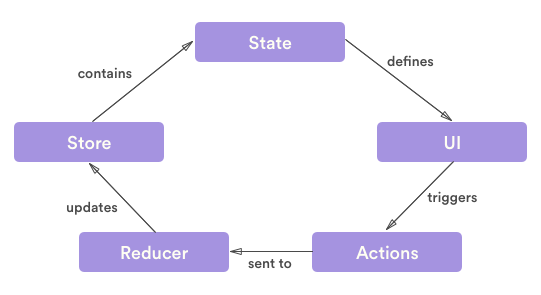
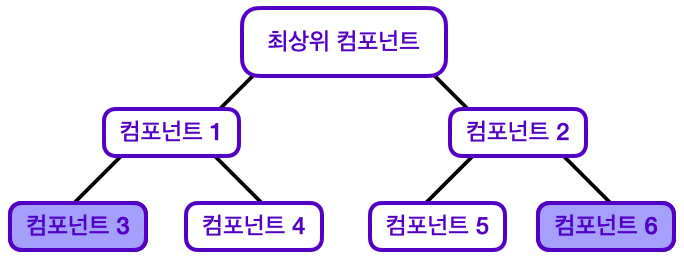
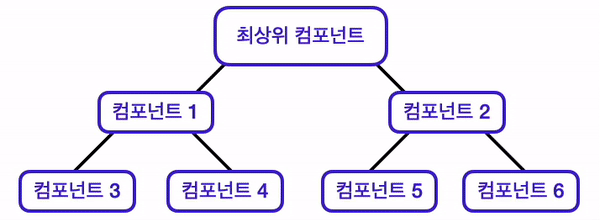

# React
## Props drilling

- props dilling 의 작동 원리
- 위와 같은 구조의 React가 있을 때 해당 배치 상태는 다소 비효율적이다.
- 상태 끌어올리기와 Props 내려주기를 여러 번 거쳐야하며 애플리케이션이 복잡해질수록 데이터 흐름이 복잡해진다.
- 컴포넌트 구조가 바뀐다면 데이터의 흐름을 바꿔야 할 수도 있다.

